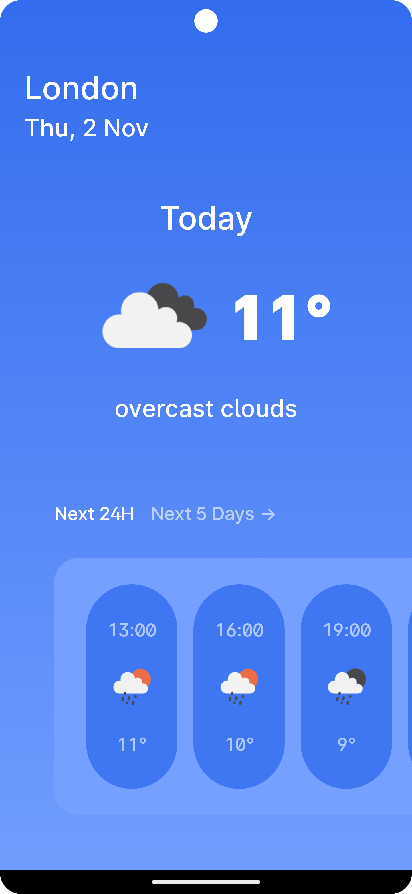
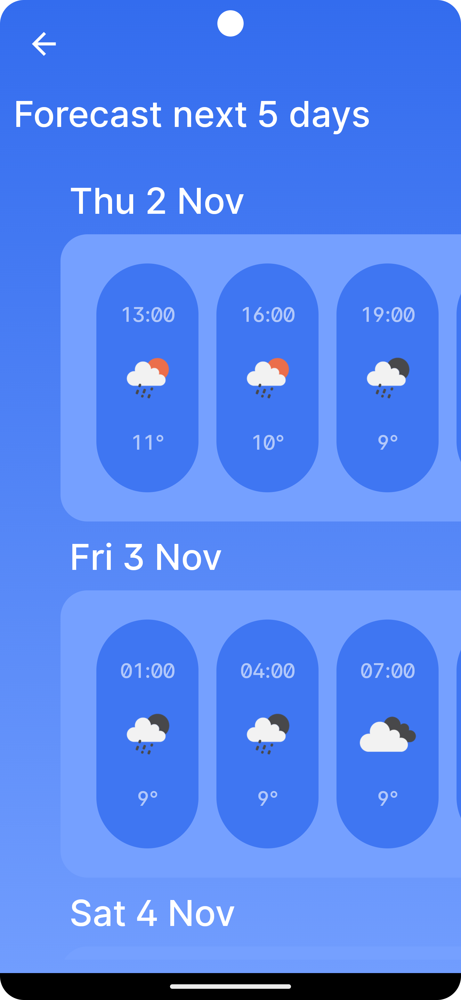
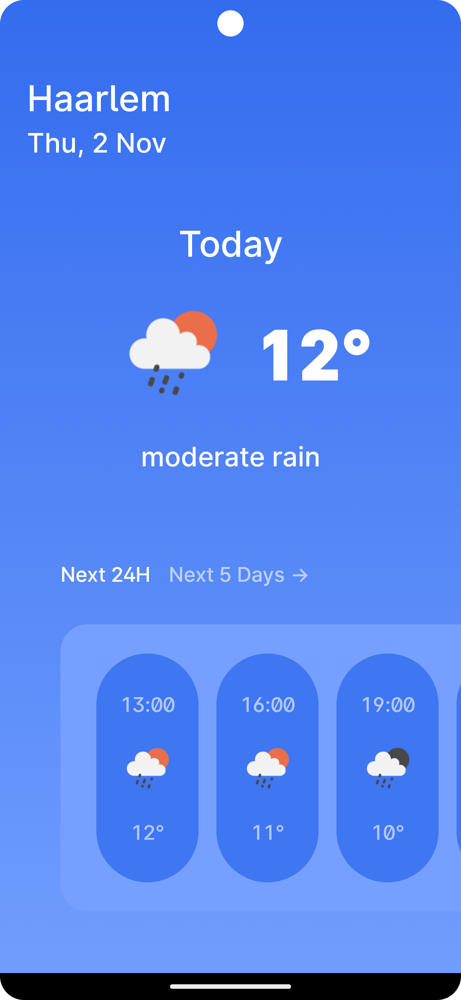

# Visma weather app

A small weather app powered by the OpenWeather API.\
Desgin based on: [Weather App by Chris Iwan](https://dribbble.com/shots/7106462-Weather-App)

Developed on a Pixel 7 Pro API 33

## Build with
- Kotlin
- Jetpack Compose
- Dagger / Hilt DI
- Ktor Http client

## Adding API key

This project requires a API key for the OpenWeather API.\
Add the API key to the `local.properties` file in the android folder of the project
`API_KEY=<YOUR_API_KEY_HERE>`

## Screenshots

	
	 
	
	

